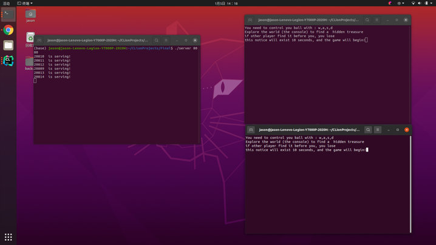
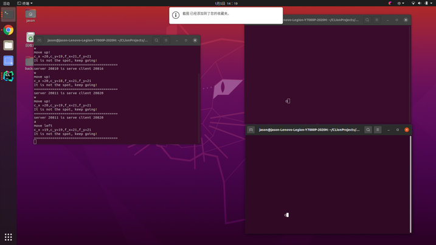
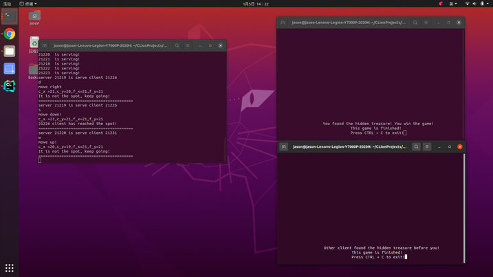
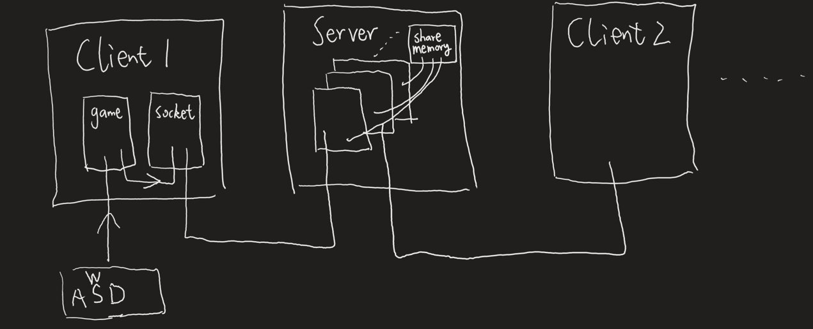
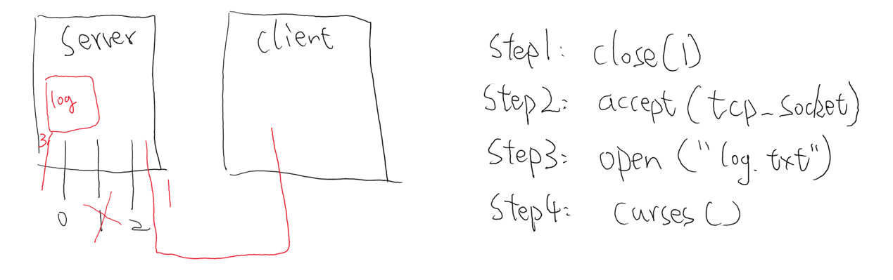

# Find_Hidden_Treasure

A multi-player client-server treasure hunt game based on Linux system calls & multiprocessing.
## Installation
    git clone https://github.com/Jas000n/find_hidden_treasure.git
    sudo apt-get install libncurses5-dev
## Usage
    cd find_hidden_treasure
    
    //use this to init game, listen on the port you like, waiting for clients(gamers) to connect, port 4399 for example
    
    ./server 4399
    
    //open a new terminal and use this to connect game server, 
    //use w, a, s, d to move the player(a ball) and hunt the hidden treasure
    
    ./client 127.0.0.1 4399	

## 1   INTRODUCTION
Each player can explore the map, i.e. the console, by using the keyboard's W, A, S, D to manipulate the ball, to find a hidden treasure (the exact location is specified by the server). When a player finds the treasure, the other player's client will be prompted to fail and a failure screen will be displayed. The game supports different number of players at the same time depending on the server performance.  
每个玩家可以通过键盘的W，A，S，D操控小球探索地图，即控制台，在过程中需要寻找一处隐藏的宝藏（具体位置由服务器指定），需要比其他连接至服务器的玩家更快找到宝藏以获胜（移动到宝藏坐标）。当其中一名玩家胜利后其他玩家客户端会被提示失败，显示失败界面。游戏随服务器性能影响支持不同数量的玩家同时游玩。

## 2   SCREENSHOTS

## 3   SYSTEM DESIGN & IMPLEMENTATION
Because threads in linux operating system are not much lighter than processes, and inter-thread communication is more complex, I choose to use multi-process for both the client and server side . The following diagram shows the system I designed

因为linux下的线程并不比进程轻量许多，而且线程间通信较为复杂，所以客户端和服务器端都选择用多进程实现。下图为我设计的系统

### Client: 
The client forks the child process named 'game' to run the curses program, and the parent process 'socket' to communicate with the server.

The child process 'game' is the front-end, which 'getchar' from the keyboard, moves the ball according to the inputs w, a, s, d, and writes the moving operation to the socket parent through the pipeline. And when it receives two different signals representing the winner and the loser, it calls different functions to show the result of the game.

The parent process ‘socket’ is responsible for connecting to the server, first tell the client itself to the server (similar to handshake), then read the direction of movement of the ball written by the child process from the pipeline, and then write the action of the ball to the server. The server will calculate the coordinates of where the ball is located, and whether it has discovered the treasure, which ensures that the client can not cheat.

### Server side: 
'prefork' to create child processes (operators) in advance. These operators determine whether other operator-connected clients have won the game by shared memory. If a player connected by an operator wins the game, the shared memory will be written to 'Y' by the operator, indicating that someone has already won the game, and a lock will be added during the write process to ensure that only the first player to find the treasure can win. If an operator's own connected player does not win the game and the shared memory has been written to 'Y', then another player has already won the game, and the player's client will show that the game has failed. Each operator will be 'killed' after serving a certain number of times, and the server will fork a new process to keep the number of operators up, to prevent resource leakage, memory fragmentation, etc.

客户端：客户端fork出game子进程负责运行curses程序，父进程socket负责与服务器通讯。

子进程game相当于前端，从键盘getch，根据输入的w，a，s，d移动小球，并且将移动的操作通过管道写给socket父进程。并且在收到代表输赢的两种不同的信号时，调用不同的函数展示游戏结果。

父进程socket负责连接服务器，先把客户端自身的情况告诉服务器（类似握手），之后从管道读子进程写入的小球的移动方向后，将小球的动作写给服务器，由服务器计算小球所在坐标以及是否探寻到宝藏，这样保证客户端不能作弊。

服务器端：用prefork的方法提前创建出子进程（接线员），这些接线员通过共享内存的方式确定其他接线员连接的客户端是否赢得了游戏。如果一个接线员连接的玩家赢得了游戏，共享内存会被该接线员写为“Y”，表明已经有人赢得了游戏，并且在写的过程会加锁，保证只有最先找到宝藏的玩家可以获胜。如果一个接线员自己连接的玩家没有赢得游戏而共享内存已被写为“Y”则表明有其他玩家已经赢得了游戏，这时玩家客户端会显示游戏失败。每个接线员在服务过一定次数过后会“死亡”，并且服务器会fork出新的进程补充上来，保持接线员的数量。
## 4 TECHNOLOGIES USED
The main techniques applied in this system are:
* 1. inter-process communication: pipes (parent and child processes within the client), sockets (between the parent process of the client and the operator within the server), shared memory (between different operators within the server), signals (sent to the client's child processes)
* 2. curses library for displaying the game interface, game rules and game results such as victory and wasted on the client side
* 3. process synchronization: POSIX semaphores (to ensure that operators read and write to shared memory without problems)
* 4. Robustness: taking into account such as not enough memory can not fork, invalid file descriptor read and write failures, etc., there will be no kernel error.

在这个系统中应用的技术主要有：
* 1. 进程间通信：管道（客户端内父进程和子进程），socket（客户端父进程和服务器内的接线员），共享内存（服务器内的不同接线员之间），信号（发送给客户端子进程）
* 2. curses库，用于在客户端上显示游戏界面、游戏规则和胜利失败等游戏结果
* 3. 进程同步：POSIX信号量（保证接线员们对共享内存的读写不出问题）
* 4. 健壮性：在函数的关键位置都做了处理，考虑了诸如内存不够不能fork，对无效文件描述符读写失败等情况，不会出现内核错误。

## 5   WHAT I HAVE LEARNED

During the process I spent the most time and encountered the most difficulties in the system design. Because I use no high-level programming language, the client and server are implemented in c language and Linux system calls, and c language does not have object-oriented characteristics, so it is difficult to design the system architecture when a clear class diagram, sort out the relationship.

Here is a little episode when designing the system, at the beginning, I used 'telnet' as the client, and wanted that anyone with a computer can play my game without installing the client, and all the logic of the front and back ends are integrated on the server side. The following figure shows the design idea at that time:

整个项目过程中在系统设计上花费的时间和遇到的困难最多。因为没有用高级编程语言，客户端和服务器都用c语言和系统调用实现，而c语言没有面向对象的特性，所以在设计系统架构的时候很难清晰的分包，理清关系。

这里说一下设计系统时候的一个小插曲，一开始用telnet当客户端，想实现任何人只要有一台电脑就能玩我这款游戏，不需要安装客户端，前后端所有逻辑都在服务器上实现。下图为当时的设计思路：

First of all, close server's 1 file descriptor off, and then accept the client telnet TCP connection, according to the principle of the lowest available, socket connection file descriptor will be 1. Then the server running curses can be displayed on the client (because curses like printf to the standard output, i.e., 1 on the write). And because the server's standard output is turned off, I can't print the system log for debugging purposes, so I open another log.txt file to write the server's runtime status and the client messages it receives for error checking purposes. However, the result of doing so is that the front and back end are mixed together, the logic is extremely confusing, so I finally give up. 

先把服务器的1文件描述符关闭，再接受客户端telnet的tcp连接，根据最低可用原则此时socket连接的文件描述符会是1，之后在服务器上运行的curses就可以显示在客户端上了（因为curses像printf一样往标准输出，即1上写）。又因为server的标准输出被关闭了，不能打印系统日志方便调试，因此又打开一个log.txt文件，将server运行时状态，接受的客户端消息写入，方便查错。然而这么做的结果就是前后端都混杂在一起，逻辑极其混乱，遂放弃。所以后来又好好设计了系统，让前后端逻辑分离。
