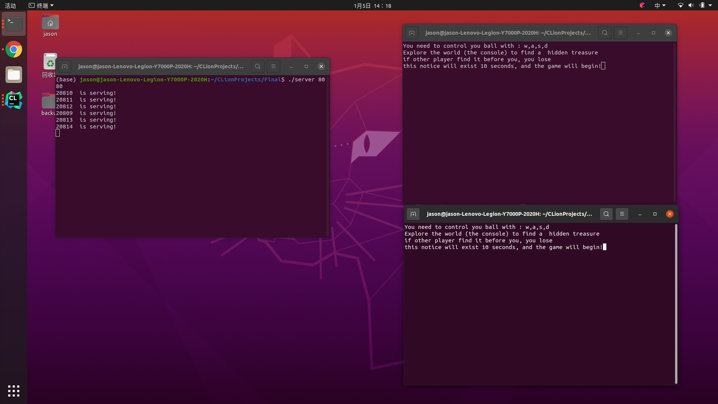
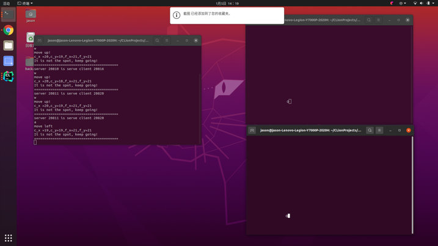
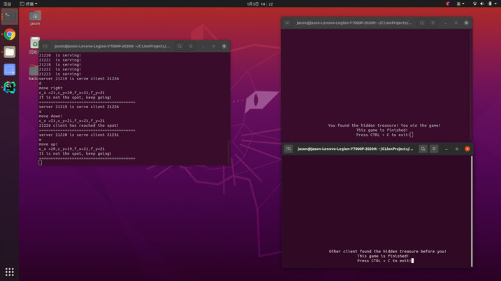
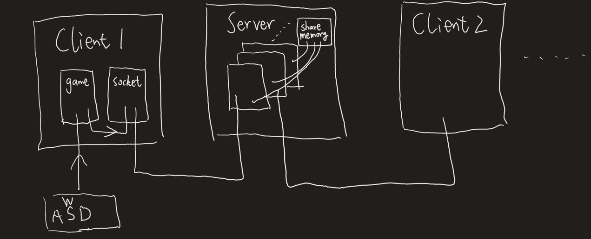
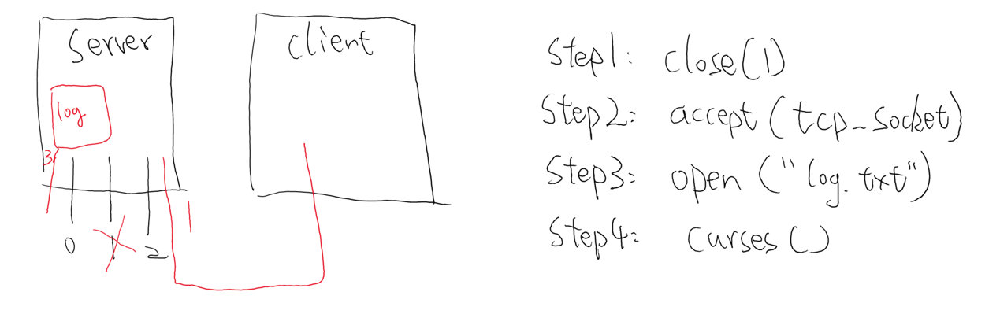

# Find_Hidden_Treasure

A multi-player client-server treasure hunt game based on Linux system calls & multiprocessing.
## Installation
    git clone https://github.com/Jas000n/find_hidden_treasure.git
    sudo apt-get install libncurses-dev
    cd find_hidden_treasure
    gcc -o server server.c -pthread
    gcc -o client client.c -lncurses
## Usage
    //use this to init game, listen on the port you like, waiting for clients(gamers) to connect, port 4399 for example
    
    ./server 4399
    
    //open a new terminal (at least 26 rows x 25 columns) and use this to connect to the game server, 
    //use w, a, s, d to move the player(a ball) and hunt the hidden treasure
    
    ./client 127.0.0.1 4399	

## 1   INTRODUCTION
Each player can explore the map, i.e. the console, by using the keyboard's W, A, S, D to manipulate the ball, to find a hidden treasure (the exact location is specified by the server). When a player finds the treasure, the other players will see a failure screen on their next move. The server preforks 5 operators and each operator serves one player at a time, so up to 5 players can play at the same time; more players wait in a queue until someone leaves.  
每个玩家可以通过键盘的W，A，S，D操控小球探索地图，即控制台，在过程中需要寻找一处隐藏的宝藏（具体位置由服务器指定），需要比其他连接至服务器的玩家更快找到宝藏以获胜（移动到宝藏坐标）。当其中一名玩家胜利后，其他玩家在下一次移动时会被提示失败，显示失败界面。服务器预先创建5个接线员，每个接线员同一时间只服务一名玩家，因此最多支持5名玩家同时游玩，更多的玩家会排队等待，直到有玩家退出。

## 2   SCREENSHOTS

## 3   SYSTEM DESIGN & IMPLEMENTATION
Because threads in Linux are not much lighter than processes, and processes are isolated from each other so that one crashing does not take down the others, I chose to use multiple processes on both the client and server side. The following diagram shows the system I designed.

因为linux下的线程并不比进程轻量许多，而且进程之间相互隔离，一个进程崩溃不会影响其他进程，所以客户端和服务器端都选择用多进程实现。下图为我设计的系统

### Client: 
The client forks the child process named 'game' to run the curses program, while the parent process 'socket' communicates with the server.

The child process 'game' is the front-end, which uses 'getch' to read from the keyboard, moves the ball according to the inputs w, a, s, d, and writes the moving operation to the socket parent through the pipe. When it receives one of the two signals representing the winner and the loser, it shows the corresponding result screen.

The parent process 'socket' is responsible for connecting to the server. It reads the direction of movement of the ball written by the child process from the pipe, writes it to the server, and waits for the server's reply. The server calculates the coordinates of the ball and whether it has found the treasure, so the client cannot fake its position. When the server replies that the player has won or lost, the parent process sends the corresponding signal to the child process 'game'.

### Server side: 
The server uses 'prefork' to create child processes (operators) in advance. These operators determine whether other operator-connected clients have won the game by shared memory, which holds the number of the current round. Each player joins the current round when connecting. If a player connected by an operator finds the treasure, the operator checks and increases the round number under a lock, so only the first player to find the treasure can win, and players connecting later start a new round. If the round number has changed by the time an operator's own player moves, another player has already won that round, and the player's client will show that the game has failed. Each operator exits after serving a certain number of clients, and the server forks a new process to keep the number of operators up, to prevent resource leakage, memory fragmentation, etc.

客户端：客户端fork出game子进程负责运行curses程序，父进程socket负责与服务器通讯。

子进程game相当于前端，从键盘getch，根据输入的w，a，s，d移动小球，并且将移动的操作通过管道写给socket父进程。在收到代表输赢的两种不同的信号时，显示对应的结果界面。

父进程socket负责连接服务器，从管道读子进程写入的小球的移动方向后，将小球的动作写给服务器并等待服务器的回复，由服务器计算小球所在坐标以及是否探寻到宝藏，这样客户端无法谎报自己的位置。服务器回复玩家胜利或失败时，父进程给game子进程发送对应的信号。

服务器端：用prefork的方法提前创建出子进程（接线员），这些接线员通过共享内存的方式确定其他接线员连接的客户端是否赢得了游戏，共享内存里记录的是当前的局数，玩家连接时加入当前这一局。如果一个接线员连接的玩家找到了宝藏，该接线员会在加锁的情况下检查并把局数加一，保证只有最先找到宝藏的玩家可以获胜，之后连接的玩家开始新的一局。如果一个接线员自己连接的玩家移动时局数已经变了，则表明有其他玩家已经赢得了这一局，这时玩家客户端会显示游戏失败。每个接线员在服务过一定数量的客户端后会自行退出，并且服务器会fork出新的进程补充上来，保持接线员的数量。
## 4 TECHNOLOGIES USED
The main techniques applied in this system are:
* 1. inter-process communication: pipes (parent and child processes within the client), sockets (between the parent process of the client and the operator within the server), shared memory (between different operators within the server), signals (from the parent process to the child process within the client)
* 2. curses library for displaying the game interface, game rules and game results such as victory and defeat on the client side
* 3. process synchronization: POSIX semaphores (to ensure that operators read and write to shared memory without problems)
* 4. Robustness: failures such as fork() running out of memory and reads/writes on invalid file descriptors are handled, so the programs do not crash.

在这个系统中应用的技术主要有：
* 1. 进程间通信：管道（客户端内父进程和子进程），socket（客户端父进程和服务器内的接线员），共享内存（服务器内的不同接线员之间），信号（客户端内父进程发送给子进程）
* 2. curses库，用于在客户端上显示游戏界面、游戏规则和胜利失败等游戏结果
* 3. 进程同步：POSIX信号量（保证接线员们对共享内存的读写不出问题）
* 4. 健壮性：在函数的关键位置都做了处理，考虑了诸如内存不够不能fork，对无效文件描述符读写失败等情况，程序不会崩溃。

## 5   WHAT I HAVE LEARNED

During the process I spent the most time and encountered the most difficulties in the system design. The client and server are implemented in C with Linux system calls. C has no object-oriented features, so without classes it was hard to split the code into clear modules and sort out their relationships.

Here is a little episode from designing the system. At the beginning, I used 'telnet' as the client, because I wanted anyone with a computer to be able to play my game without installing a client, with all the logic of the front and back ends on the server side. The following figure shows the design idea at that time:

整个项目过程中在系统设计上花费的时间和遇到的困难最多。客户端和服务器都用c语言和系统调用实现，而c语言没有面向对象的特性，所以在设计系统架构的时候很难清晰地分包，理清关系。

这里说一下设计系统时候的一个小插曲，一开始用telnet当客户端，想实现任何人只要有一台电脑就能玩我这款游戏，不需要安装客户端，前后端所有逻辑都在服务器上实现。下图为当时的设计思路：

First, the server closes its file descriptor 1 (stdout) and then accepts the client's telnet TCP connection. Since the lowest available file descriptor is always used, the socket connection gets file descriptor 1. Then curses running on the server is displayed on the client (because curses, like printf, writes to standard output, i.e. file descriptor 1). Because the server's standard output is closed, I couldn't print logs for debugging, so I opened another file, log.txt, to record the server's runtime status and the client messages it receives. However, this mixed the front end and the back end together and made the logic extremely confusing, so I gave up in the end. 

先把服务器的1文件描述符关闭，再接受客户端telnet的tcp连接，根据最低可用原则此时socket连接的文件描述符会是1，之后在服务器上运行的curses就可以显示在客户端上了（因为curses像printf一样往标准输出，即1上写）。又因为server的标准输出被关闭了，不能打印系统日志方便调试，因此又打开一个log.txt文件，将server运行时状态，接受的客户端消息写入，方便查错。然而这么做的结果就是前后端都混杂在一起，逻辑极其混乱，遂放弃。所以后来又好好设计了系统，让前后端逻辑分离。
